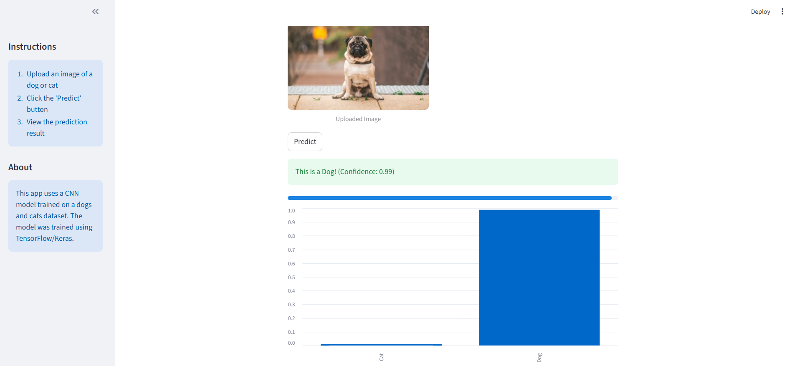

<h1 align="center">🐶🐱 CATS VS DOGS IMAGE CLASSIFICATION USING CNN</h1>

  
  
  
  

---

<h2>📘 Project Overview</h2>

This project focuses on building a <strong>Convolutional Neural Network (CNN)</strong> using <strong>Keras (TensorFlow backend)</strong> to classify images into two categories: <strong>Dog</strong> and <strong>Cat</strong>.

The objective is to learn meaningful visual features directly from image data and develop a robust deep learning model capable of generalizing well to unseen images.

The project follows an <strong>end-to-end deep learning workflow</strong>:
Image preprocessing → Model architecture design → Training → Validation → Performance evaluation.

---

<h2>🎯 Problem Statement</h2>

Image classification is a core computer vision task with applications in security, healthcare, retail, and automation.
This project addresses the challenge of:

<ul>
  <li>📸 Learning visual patterns from raw image pixels</li>
  <li>🧠 Distinguishing between visually similar classes</li>
  <li>📈 Improving model generalization using CNN principles</li>
</ul>

---

<h2>✨ Key Features</h2>

<ul>
  <li>🧠 CNN-based image classification using Keras</li>
  <li>🖼️ Image preprocessing and normalization</li>
  <li>🔁 Data augmentation to reduce overfitting</li>
  <li>⚖️ Binary classification using sigmoid activation</li>
  <li>📈 Training vs validation performance monitoring</li>
  <li>🚀 Clean and modular notebook-based implementation</li>
</ul>

---

<h2>🧩 Tech Stack</h2>

<table>
<tr>
  <td><strong>Language</strong></td>
  <td>Python 🐍</td>
</tr>
<tr>
  <td><strong>Libraries</strong></td>
  <td>NumPy, Matplotlib</td>
</tr>
<tr>
  <td><strong>Deep Learning Framework</strong></td>
  <td>TensorFlow / Keras</td>
</tr>
<tr>
  <td><strong>Model Type</strong></td>
  <td>Convolutional Neural Network (CNN)</td>
</tr>
<tr>
  <td><strong>Problem Type</strong></td>
  <td>Binary Image Classification</td>
</tr>
</table>

---

<h2>📊 Dataset Overview</h2>

<ul>
  <li><strong>Classes:</strong> Dog, Cat</li>
  <li><strong>Data Type:</strong> RGB Images</li>
  <li><strong>Input Shape:</strong> Resized images (e.g., 180x180)</li>
</ul>

The dataset consists of labeled images of cats and dogs, split into training and validation sets.
Images are preprocessed through resizing, normalization, and optional augmentation techniques.

---

<h2>📂 Project Structure</h2>

<pre>
📁 Cats-vs-Dogs-CNN
│
├── Cat_vs_Dog_Dataset_Keras.ipynb
├── images
│   └── interface.png
│   └── predict.png
├── requirements.txt
├── app.py
├── cli.py
├── dog_cat_cnn_model.keras
├── dog_cat_final_model.keras
└── README.md
</pre>

---

<h2 align="center">🖥️ Images</h2>

<h3 align="center">📈 Prediction Page</h3>

  
  

---

<h2>📈 Model Evaluation</h2>

<ul>
  <li>Training Accuracy vs Validation Accuracy</li>
  <li>Training Loss vs Validation Loss</li>
  <li>Overfitting analysis</li>
  <li>Generalization performance on unseen images</li>
</ul>

---

<h2>🧠 Skills Demonstrated</h2>

<ul>
  <li>Convolutional Neural Networks (CNN)</li>
  <li>Image preprocessing & data augmentation</li>
  <li>Deep Learning model training using Keras</li>
  <li>Model evaluation and performance tuning</li>
  <li>Computer Vision fundamentals</li>
</ul>

---

<h2>🚀 How to Run the Project</h2>

<ol>
  <li>Clone the repository:
    <pre><code>git clone https://github.com/BIKRANT-RAWAT/Binary_Image_Classification_Cats_vs_Dogs_using_CNN</code></pre>
  </li>
  <li>Create and activate a virtual environment:
    <pre><code>python -m venv venv
venv\Scripts\activate</code></pre>
  </li>
  <li>Install dependencies:
    <pre><code>pip install -r requirements.txt</code></pre>
  </li>
  <li>Run the notebook:
    <pre><code>streamlit run app.py</code></pre>
  </li>
</ol>

---

<h2>💡 Learning Outcomes</h2>

<ul>
  <li>🧠 Practical understanding of CNN architecture</li>
  <li>📸 Hands-on experience with image datasets</li>
  <li>📈 Model performance analysis and optimization</li>
  <li>🚀 End-to-end deep learning workflow</li>
</ul>

---

<h2>🤝 Collaboration</h2>

Contributions and suggestions are welcome!

<ol>
  <li>Fork the repository 🍴</li>
  <li>Create a new branch</li>
  <li>Commit your changes</li>
  <li>Open a Pull Request 🚀</li>
</ol>

---

<h2>🙏 Acknowledgements</h2>

<ul>
  <li>🐶🐱 Kaggle Cats vs Dogs Dataset</li>
  <li>🧠 PWSkills Team</li>
  <li>📘 TensorFlow & Keras Documentation</li>
  <li>🧠 Deep Learning & Open-source community</li>
</ul>

---

<h3 align="center">⭐ If you like this project, give it a star on GitHub! ⭐</h3>

Made with ❤️ using Python & Deep Learning

